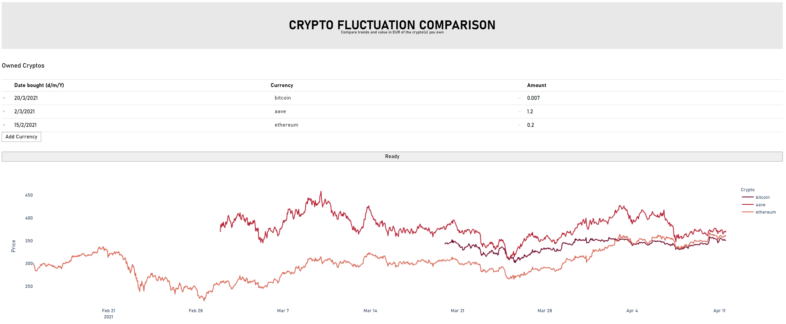

## **Cryptocurrency Comparison**

The aim of the project is to present multiple cryptocurrencies relying on user defined amount. 
All cryptos will be presented in EUR using multiple plots - including comparison with the value on the date when the 
coins have been bought.

### **Set-up**

1. Install packages: \
`$ pip install -r requirements.txt
` 
2. Run main.py
****

#### **To do list:**
* Make it easier to enter the data
* Add multiple plots for the overview
* Add more options for currencies (if necessary)  
* Improve code quality - bugs, readability, design
* Deploy using AWS

"# crypto_overview" 
